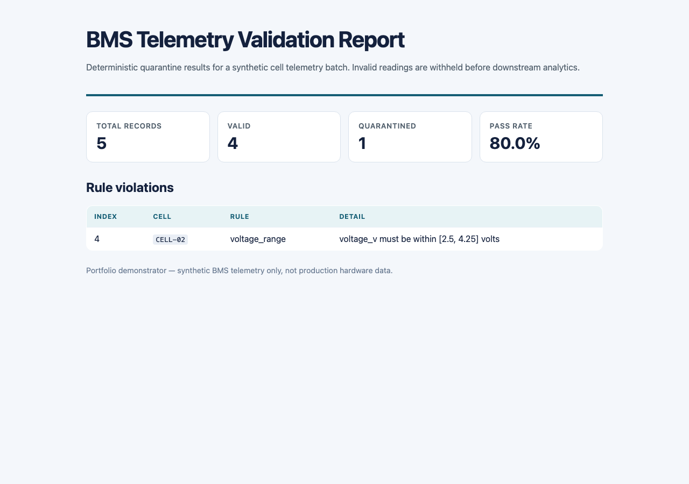

# Battery Telemetry Validation Harness

Deterministic validation gate for synthetic BMS cell telemetry — catches out-of-range voltage, temperature, and SOC readings, missing fields, duplicate samples, and non-monotonic timestamps before data reaches downstream analytics or safety-critical control logic.

> **Scope:** Synthetic telemetry only. Demonstrates automotive/BMS QA validation patterns; not connected to production ECU firmware or live hardware.



## Problem

Battery management systems ingest high-frequency cell telemetry (voltage, temperature, state-of-charge) that feeds balancing algorithms, thermal management, and fault handlers. Bad or inconsistent records — stale timestamps, duplicated readings, out-of-spec voltages — can propagate into safety-critical logic. This harness provides a **deterministic, rule-based quarantine layer** with auditable JSON reports suitable for CI pipelines and test benches.

## Features

- C++17 validation core with 7 deterministic rules
- CLI (`bms-validate`) supporting CSV and JSON input, JSON report output
- Python synthetic data generator with configurable fault injection
- GoogleTest unit tests via CMake/CTest
- GitHub Actions CI (build, unit tests, end-to-end demo)

## Validation rules

| Rule | Description |
|------|-------------|
| `timestamp_required` | `timestamp_iso` must be present |
| `timestamp_format` | ISO-8601 `YYYY-MM-DDTHH:MM:SSZ` |
| `cell_id_required` | Non-empty `cell_id` |
| `voltage_range` | 2.5–4.25 V |
| `temperature_range` | −20–60 °C |
| `soc_range` | 0–100 % |
| `duplicate_reading` | Unique `(timestamp_iso, cell_id)` per batch |
| `non_monotonic_timestamp` | Timestamps non-decreasing per `cell_id` |

## Build

**Requirements:** CMake 3.16+, C++17 compiler, Python 3.8+

```bash
make build    # configure + compile
make test     # run GoogleTest suite via CTest
make demo     # generate data, validate samples, write artifacts/
make clean    # remove build + artifact outputs
```

Manual CMake:

```bash
cmake -S cpp -B cpp/build -DCMAKE_BUILD_TYPE=Release
cmake --build cpp/build --parallel
cd cpp/build && ctest --output-on-failure
```

## Usage

### Validate CSV

```bash
./cpp/build/bms-validate \
  --input examples/sample_telemetry.csv \
  --output artifacts/report.json \
  --format csv
```

### Validate JSON

```bash
./cpp/build/bms-validate \
  --input records.json \
  --output artifacts/report.json \
  --format json
```

### Generate synthetic telemetry

```bash
python3 python/generate_telemetry.py \
  --output examples/generated.csv \
  --records 20 \
  --inject-faults 3
```

Supported fault types (via `--fault-types`, comma-separated):

| Fault type | Validator rule triggered |
|------------|--------------------------|
| `voltage` | `voltage_range` |
| `temperature` | `temperature_range` |
| `soc` | `soc_range` |
| `bad_timestamp` | `timestamp_format` |
| `missing_cell_id` | `cell_id_required` |
| `duplicate` | `duplicate_reading` |
| `non_monotonic` | `non_monotonic_timestamp` |

Use `--fault-types` to inject specific faults deterministically for the same `--seed`:

```bash
python3 python/generate_telemetry.py \
  --output examples/generated.csv \
  --records 30 \
  --seed 42 \
  --fault-types voltage,duplicate,non_monotonic
```

Without `--fault-types`, `--inject-faults N` cycles through all seven injectors in a reproducible order for the given seed.

## Report schema

```json
{
  "total_records": 10,
  "valid_records": 8,
  "invalid_records": 2,
  "pass_rate": 0.8,
  "rule_violations": [
    {
      "rule": "voltage_range",
      "record_index": 3,
      "cell_id": "CELL-01",
      "detail": "voltage_v must be within [2.5, 4.25] volts"
    }
  ],
  "quarantined_record_indices": [3, 7]
}
```

## Project layout

```
battery-telemetry-validation-harness/
├── cpp/                  # C++ validator + CLI + tests
├── python/               # Synthetic telemetry generator
├── examples/             # Sample CSV inputs
├── docs/                 # Architecture notes + screenshots
├── .github/workflows/    # CI pipeline
└── Makefile              # build, test, demo targets
```

See [docs/architecture.md](docs/architecture.md) for component details.

## Resume bullet

> Built a C++17 BMS telemetry validation harness with deterministic quarantine rules, Python fault-injection test data, CMake/CTest unit tests, and GitHub Actions CI — catching out-of-range cell readings and timestamp integrity issues before synthetic data reaches downstream analytics pipelines.

## License

MIT — see [LICENSE](LICENSE).
